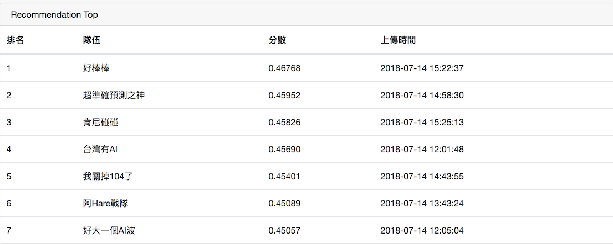
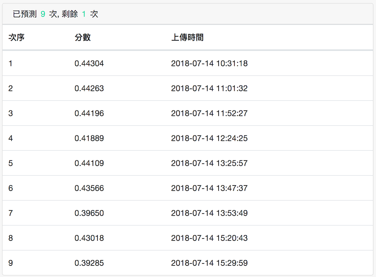

# 2018 年 104 Hackathon 程式碼

2018 年 104 Hackathon 程式碼。

## Code

- [job-action-count.ipynb](job-action-count.ipynb) - Job action 統計方式
- [job-analysis.ipynb](job-analysis.ipynb) - 將測試資料集轉換為輸出檔案。

## Data

- [data/job-action-stat.csv](data/job-action-stat.csv) - 每個 Job 在工作在資料集中個動作的統計結果。
- [data/testset-click.jsonl](data/testset-click.jsonl) - 官方提供的測試資料集，有 44,625 筆資料。
- [data/testset-click-small.jsonl](data/testset-click-small.jsonl) - 將 testset-click.jsonl 取出前 1000 筆資料的小型測試資料集。

## Result

在 104 競賽中將 "viewJob", "applyJob", "saveJob" 三個欄位加總得到 score 拿來排序 "joblist" 的結果為 0.44304。而將原本的 "joblist" 隨機排序後的結果約為 0.39，而第一名為 0.46768。可知該方式仍有一定程度的效果在。

#### Ranking

#### Updated score

## Link

- [2018-104Hackathon-Recommendation](https://github.com/104corp/2018-104Hackathon-Recommendation)
